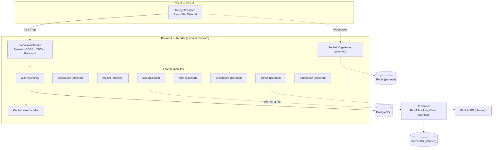
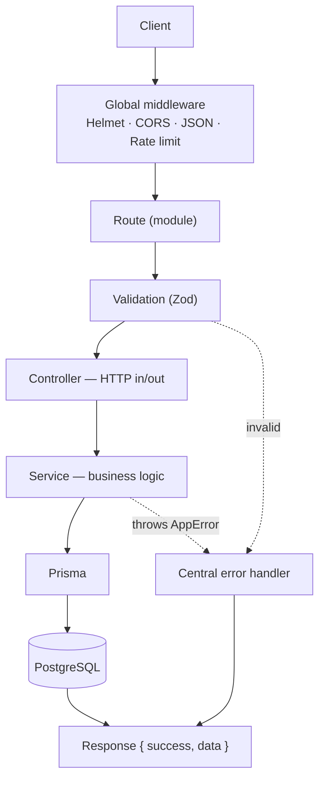
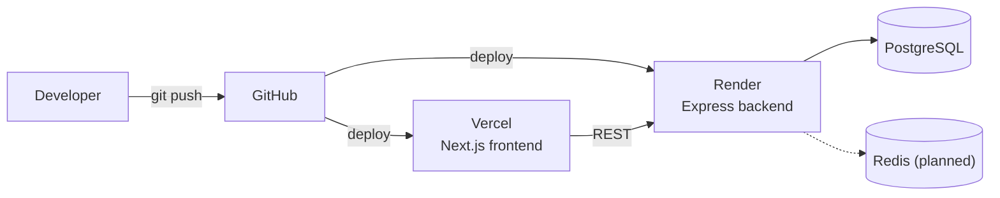
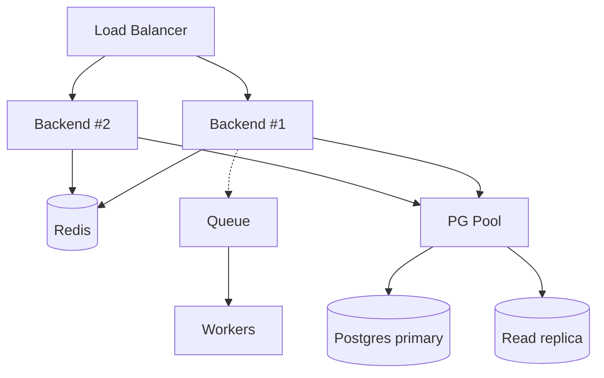
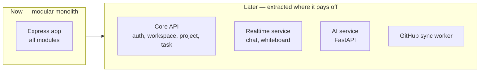

# Architecture

> System-level view of how DevFlow is put together, why it's built this way, and how it's meant to grow.
> Related: [system-design.md](system-design.md) · [backend.md](backend.md) · [database.md](database.md) · [deployment.md](deployment.md)

---

## Purpose

This document explains the **overall shape** of DevFlow — the major pieces, how they talk to each other, and the reasoning behind the big choices. It's the map a new engineer reads first. Module-level detail lives in [backend.md](backend.md); data modelling in [database.md](database.md); scaling specifics in [system-design.md](system-design.md).

---

## Overview

DevFlow is a **modular monolith**. There is one deployable backend (Express + TypeScript) organised into independent feature modules, one frontend (Next.js), one database (PostgreSQL via Prisma), and a **planned** standalone AI service (FastAPI).

> [!NOTE]
> **Current reality:** only the **auth** module is implemented. Realtime, AI, and Redis appear in the design because that's the intended direction — they are not running yet. Every "planned" box in the diagrams below is design intent, not shipped code.

At a glance:

| Layer | Technology | Status |
|---|---|---|
| Client | Next.js 16, React 19, TypeScript, Tailwind 4 | Scaffolding |
| API | Node.js ≥ 20, Express 5, TypeScript | Auth live |
| Data access | Prisma 6 | Live |
| Database | PostgreSQL 14+ | Live |
| Realtime | Socket.IO, Redis | Planned |
| AI | FastAPI, LangChain, vector DB | Planned |

---

## Overall System Architecture



**Reading the diagram:** all HTTP traffic enters through a shared middleware chain, fans out to the feature module that owns the route, and every module reaches the database through Prisma. Errors funnel to one handler. The dotted pieces are planned.

---

## Why This Architecture

### Why a modular monolith (not microservices yet)

A 2–5 person team ships features fastest when the code is in one place: one repo to run, one deploy, one database, one set of types shared end-to-end. Microservices would add network hops, distributed transactions, and operational overhead we can't justify at this stage.

The **module boundaries** are the hedge. Each feature is self-contained (`routes → controller → service → Prisma`) and doesn't import another module's internals. When one module genuinely needs to scale independently later, it can be lifted out with a known seam — see [Future Microservices](#future-microservices).

> [!TIP]
> The rule that keeps this option open: **modules talk through services, never by reaching into each other's files.** Cross-module needs go through a service function, which is the same thing you'd later replace with a network call.

### Why Express + TypeScript

Express is small, well understood, and unopinionated — it doesn't fight a modular layout. TypeScript in `strict` mode gives us end-to-end types from the Zod schema through the service to the Prisma model, catching whole classes of bugs before runtime.

### Why Prisma + PostgreSQL

The domain is relational (users, workspaces, members, projects, tasks — see [database.md](database.md)). PostgreSQL handles those relations and constraints natively. Prisma gives type-safe queries, a readable schema as the single source of truth, and versioned migrations.

---

## Communication

| Path | Protocol | Format | Status |
|---|---|---|---|
| Frontend → Backend | HTTPS / REST | JSON `{ success, data }` | (working) |
| Frontend ↔ Backend (live) | WebSocket (Socket.IO) | Events per room | (planned) |
| Backend → Database | TCP (Prisma) | SQL | (working) |
| Backend → AI service | Internal HTTP | JSON | (planned) |
| Backend → GitHub | HTTPS | REST / OAuth | (planned) |

All REST responses share one envelope so clients handle success and failure uniformly:

```jsonc
{ "success": true,  "data": { /* payload */ } }
{ "success": false, "message": "Reason" }
```

See [api.md](api.md) for conventions and [authentication.md](authentication.md) for how the Bearer token flows on protected routes.

---

## Request Flow

Every request moves through the same stages, each with one responsibility:



The controller never contains business logic; the service is the only layer that touches Prisma; errors are thrown, not returned, and formatted once. Full breakdown in [backend.md](backend.md).

---

## Deployment



- **Frontend → Vercel:** Git-connected, preview deploys per PR.
- **Backend → Render:** builds with `npm run build`, runs `npm start`.
- **Database:** managed PostgreSQL (Render or a provider), reached via `DATABASE_URL`.
- **Config:** environment variables set per platform; the backend validates them at boot and refuses to start if any are missing ([config/env.ts](../backend/src/config/env.ts)).

Full steps: [deployment.md](deployment.md).

---

## Storage

| Data | Where | Status |
|---|---|---|
| Relational data (users, workspaces, tasks…) | PostgreSQL | (working) |
| Sessions / presence / socket fan-out | Redis | (planned) |
| File uploads (avatars, attachments) | Object storage (e.g. Cloudinary/S3) | (planned) |
| Embeddings for AI retrieval | Vector DB | (planned) |

Today everything lives in PostgreSQL. Redis, object storage, and the vector DB enter as their dependent features land.

---

## Design Decisions

| Decision | Choice | Rationale |
|---|---|---|
| App topology | Modular monolith | Fast for a small team; clean seams to split later |
| Module layout | Feature folders (`routes/controller/service/validation`) | Change one feature in one place |
| Data access | Prisma only in services | Single source of DB access; easy to test/replace |
| Auth | Stateless JWT | No session store; scales horizontally |
| Validation | Zod at the edge | Bad input never reaches business logic |
| Errors | `AppError` + central handler | One response shape; no leaked internals |
| Config | Zod-validated env, fail fast | Misconfiguration caught at boot, not mid-request |

---

## Tradeoffs

- **Monolith vs services:** simpler now, but a runaway module could bloat the deploy. Mitigated by strict module boundaries.
- **Stateless JWT:** scales trivially but can't be revoked mid-lifetime. Refresh tokens + a revocation list are the planned fix ([authentication.md](authentication.md)).
- **Prisma:** excellent DX, but complex queries occasionally need raw SQL — acceptable and supported.
- **Single database:** simple until a module's write load dominates; addressed by read replicas / partitioning later ([system-design.md](system-design.md)).

---

## Scalability

The near-term path keeps the monolith and scales around it:

1. **Stateless backend** → run multiple instances behind a load balancer (JWT makes this free).
2. **Redis** for caching hot reads, rate-limit state, and Socket.IO fan-out across instances.
3. **Database** → connection pooling, indexes, then read replicas.
4. **Background work** → a queue + workers for email, GitHub sync, and AI jobs.



Details and thresholds live in [system-design.md](system-design.md).

---

## Future Microservices

When (and only when) a module's scaling or team-ownership needs diverge from the rest, the boundary is already drawn:



The AI service is expected to be **first out** — it's a different language (Python) and runtime profile. Realtime is a strong second candidate because its scaling curve (persistent connections) differs from request/response traffic.

---

## Best Practices

- Keep modules independent — cross-module logic goes through a service call, never a direct file import.
- New feature = new folder following the existing four-file pattern (see [backend.md](backend.md) and [folder-structure.md](folder-structure.md)).
- All DB access stays in services; controllers stay thin.
- Add an index the moment a query filters or joins on a column (see [database.md](database.md)).
- Never leak internal errors — throw `AppError`, let the central handler format it.

---

## Developer Notes

- The `socket.io`, `redis`, and `ioredis` packages are already in `backend/package.json` but **not wired up** — don't assume realtime works because the dependency is present.
- Non-auth module folders are **empty placeholders**. They mark intended structure, not implemented behaviour.
- Start the backend with `npm run dev`; it exposes `GET /health` for a quick liveness check.
- When you add a module, register its router in [index.ts](../backend/src/index.ts) after the global middleware and before the error handler.

---

_Next: [system-design.md](system-design.md) — scaling strategy, caching, queues, and workers in depth._
