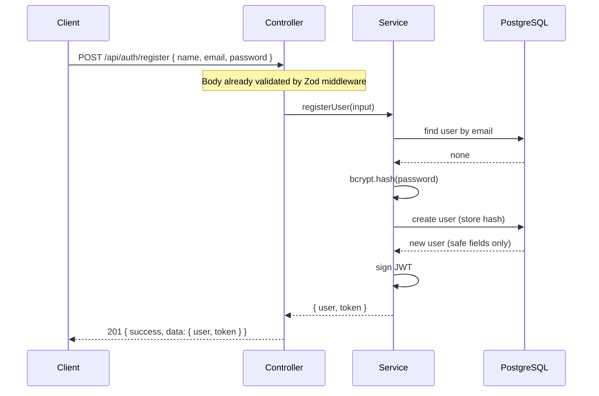
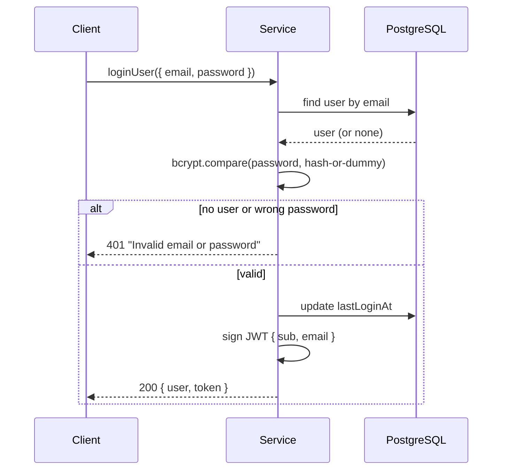
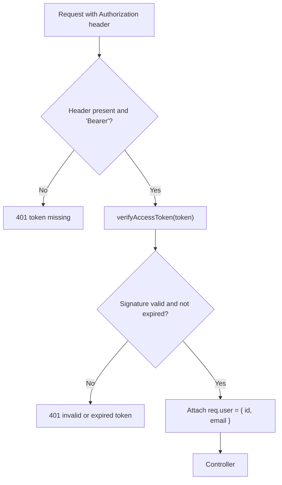

# Authentication

> How DevFlow authenticates users: registration, login, tokens, protected routes, and the security reasoning behind each choice.
> Related: [backend.md](backend.md) · [database.md](database.md) · [architecture.md](architecture.md) · [api.md](api.md)

---

## Purpose

This document explains the only fully implemented module in DevFlow. It is written both as a guide to the code and as a record of the security decisions, so a reviewer can see not just *what* the auth module does but *why*. Where a protection is not yet in place, it is listed honestly under [Future Work](#future-work).

---

## Overview

DevFlow uses **stateless authentication with JSON Web Tokens (JWT)**.

- A **JWT** is a signed string the server issues after a successful login. It contains a small set of claims (the user's id and email) and a signature.
- The client stores the token and sends it on later requests in the `Authorization` header as `Bearer <token>`.
- The server verifies the signature to trust the token. Because the token itself proves identity, the server keeps **no session state** — any backend instance can serve any request.

This is a deliberate tradeoff: statelessness makes scaling simple (see [system-design.md](system-design.md)), at the cost of not being able to revoke a token before it expires. The plan to address that is refresh tokens, under [Future Work](#future-work).

**Endpoints available today:**

| Method | Endpoint | Requires token | Purpose |
|---|---|---|---|
| `POST` | `/api/auth/register` | No | Create an account |
| `POST` | `/api/auth/login` | No | Sign in and receive a token |
| `GET` | `/api/auth/me` | Yes | Return the current user |

---

## Password Hashing

Passwords are never stored in plain text. They are hashed with **bcrypt** before being saved, and the original password is never written anywhere.

```typescript
const passwordHash = await bcrypt.hash(password, env.BCRYPT_SALT_ROUNDS);
```

- **What hashing gives us:** if the database is ever exposed, the stored hashes cannot be reversed back into passwords.
- **The salt** is generated by bcrypt automatically and stored as part of the hash. It ensures two users with the same password get different hashes, defeating precomputed-table attacks.
- **The cost factor** (`BCRYPT_SALT_ROUNDS`, default 12) controls how slow hashing is. Slower is better against brute force. It is configurable so it can be raised as hardware improves, without a code change.

> [!NOTE]
> The cost factor is read from the validated environment, not hard-coded. See [Configuration](#configuration).

---

## Registration



Steps in the service:

1. Check whether the email already exists. If so, throw `Conflict` (HTTP 409).
2. Hash the password with bcrypt.
3. Create the user, using a Prisma `select` so only safe fields are returned.
4. Sign a JWT and return the user and token together.

Registration returns a token so the user is signed in immediately after creating an account — the same response shape as login, which keeps the client simple.

---

## Login



Steps in the service:

1. Look up the user by email.
2. Compare the password against the stored hash with `bcrypt.compare`.
3. If the user is missing or the password is wrong, throw `Unauthorized` (HTTP 401) with a **single, identical message**.
4. On success, update `lastLoginAt`, sign a token, and return the user (without the hash) and the token.

### Why the error message is deliberately vague

The response is `"Invalid email or password"` whether the email is unknown or the password is wrong. A message like "no account with that email" would let an attacker discover which emails are registered (user enumeration). One message for both cases prevents that.

### Timing-attack mitigation

There is a subtler version of the same leak. If the code skipped `bcrypt.compare` when the user did not exist, an unknown email would return faster than a known one, and an attacker could measure the difference to enumerate accounts. To prevent this, the comparison always runs — against a dummy hash when the user is missing — so the response time is the same either way:

```typescript
const passwordHash = user?.passwordHash ?? DUMMY_HASH;
const valid = await bcrypt.compare(password, passwordHash);
if (!user || !valid) {
  throw Unauthorized("Invalid email or password");
}
```

---

## Tokens

Tokens are created and verified through a small utility so the logic lives in one place ([utils/jwt.ts](../backend/src/utils/jwt.ts)).

```typescript
export interface JwtPayload {
  sub: string;   // the user id (the standard "subject" claim)
  email: string;
}

export const signAccessToken = (payload: JwtPayload): string =>
  jwt.sign(payload, env.JWT_SECRET, { expiresIn: env.JWT_EXPIRES_IN });
```

Design points:

- **Minimal claims.** The token carries only the user id (`sub`) and email — enough to identify the user, nothing sensitive. No roles or personal data are embedded, so a leaked token reveals little and cannot go stale in a harmful way.
- **`sub` is the standard claim** for the subject (the user) of a token, so the payload follows the JWT convention.
- **Expiry** is set from `JWT_EXPIRES_IN` (default 7 days). After that the token is rejected and the user must log in again.
- **The signing secret** (`JWT_SECRET`) is validated at startup to be at least 32 characters. A short or missing secret makes tokens forgeable, so the server refuses to start without a strong one.

---

## Token Verification and Protected Routes

Protected routes are guarded by the `authenticate` middleware, which runs before the controller.

```typescript
// middleware/auth.middleware.ts
export const authenticate = (req, _res, next) => {
  const authHeader = req.headers.authorization;
  if (!authHeader?.startsWith("Bearer ")) {
    return next(Unauthorized("Authentication token missing"));
  }
  const token = authHeader.slice("Bearer ".length).trim();
  const payload = verifyAccessToken(token);   // throws Unauthorized if invalid
  req.user = { id: payload.sub, email: payload.email };
  next();
};
```



`verifyAccessToken` checks the signature and expiry, narrows the decoded value to the expected shape, and throws `Unauthorized` on any problem. Because it throws an `AppError`, the failure is formatted by the central error handler like every other error (see [backend.md](backend.md#error-handling)).

### The `/me` endpoint reads from the database

`GET /me` does not simply return the token's contents. It uses the id from the token to fetch the current user record:

```typescript
export const me = asyncHandler(async (req, res) => {
  const user = await getUserById(req.user!.id);
  sendSuccess(res, { user });
});
```

This matters because a token is a snapshot from login time. If the user updated their profile — or was deactivated — after the token was issued, returning the token's stale contents would be wrong. Reading the live record keeps `/me` accurate.

---

## Preventing Password-Hash Leakage

The password hash must never leave the server. Two layers protect against this:

1. **Prisma `select`.** Read queries that return a user use a `publicUserSelect` that lists only safe fields. The hash is never selected, so it cannot be returned even by accident, and this holds even if new sensitive columns are added later.
2. **Explicit removal on the login path.** Where the full record is needed (login reads the hash to compare it), the hash and refresh token are stripped before the user is returned.

```typescript
const publicUserSelect = {
  id: true, name: true, email: true, avatar: true, bio: true,
  githubUrl: true, linkedinUrl: true, isActive: true,
  createdAt: true, updatedAt: true,
} as const;
```

---

## Configuration

The auth module depends on these environment variables, all validated at startup in [config/env.ts](../backend/src/config/env.ts):

| Variable | Purpose | Rule |
|---|---|---|
| `JWT_SECRET` | Signs and verifies tokens | At least 32 characters |
| `JWT_EXPIRES_IN` | Token lifetime | Default `7d` |
| `BCRYPT_SALT_ROUNDS` | bcrypt cost factor | 10–15, default 12 |

If any required value is missing or invalid, the server exits at startup with a clear message rather than failing later. See the [README](../README.md#environment-variables).

---

## Rate Limiting

The authentication endpoints are rate limited to slow down brute-force and credential-stuffing attempts:

```typescript
const authLimiter = rateLimit({
  windowMs: 15 * 60 * 1000, // 15 minutes
  max: 20,
});
app.use("/api/auth", authLimiter, authRoutes);
```

> [!WARNING]
> This limiter counts requests **in the memory of a single instance**. It is correct for the current single-instance deployment, but if the backend is run as multiple instances, the count must move to a shared store (Redis). See [system-design.md](system-design.md#redis).

---

## Security Summary

| Protection | Status | Notes |
|---|---|---|
| Password hashing (bcrypt, cost 12) | In place | Configurable cost factor |
| Password hash never returned | In place | Prisma `select` plus explicit stripping |
| Vague auth error message | In place | Prevents user enumeration |
| Constant-time login | In place | Dummy-hash comparison |
| Strong signing secret enforced | In place | Minimum 32 characters, checked at startup |
| Token verification | In place | Signature and expiry checked, shape narrowed |
| Fresh user on `/me` | In place | Deactivation and edits take effect at once |
| Rate limiting on auth | In place | Single-instance only for now |
| Security headers, CORS | In place | Helmet and restricted origins |
| Refresh tokens and revocation | Planned | See below |
| Role-based access control | In place (workspace-scoped) | `authorize()` middleware; see [workspace.md](workspace.md) |
| Email verification, password reset | Planned | — |

---

## Future Work

### Refresh tokens and logout

Access tokens are short-lived and cannot be revoked before they expire. The plan is a standard refresh-token flow: a short-lived access token plus a longer-lived refresh token that can be rotated and revoked. The `User` model already has a `refreshToken` field reserved for this ([database.md](database.md)), but it is not yet used. This also enables a real logout (invalidating the refresh token).

### Role-based access control (RBAC) — implemented for workspaces

The `WorkspaceMember` model has a role field (`OWNER`, `ADMIN`, `MEMBER`). The `authorize(...)` middleware checks a caller's role for a given workspace before allowing an action, composing with `authenticate` exactly as validation does. It is the single place workspace roles are checked. See [workspace.md](workspace.md#authorization-model). Applying the same pattern to future workspace-scoped resources (projects, tasks) is the remaining work.

### Email verification and password reset

Both require sending email, which should run as a background job rather than in the request (see [system-design.md](system-design.md#queues-and-background-workers)). Password-reset codes are short-lived and are a natural fit for Redis with a TTL.

---

## Design Decisions

| Decision | Choice | Rationale |
|---|---|---|
| Auth style | Stateless JWT | No session store; scales horizontally |
| Token claims | id and email only | Minimal exposure if leaked |
| Token utility | One `jwt.ts` helper | Signing and verifying in one place |
| Login errors | One vague message | Prevents user enumeration |
| Login timing | Always run bcrypt.compare | Prevents timing-based enumeration |
| `/me` source | Database, not token | Always current |
| Hash safety | `select` plus stripping | Defence in depth |

---

## Best Practices

- Put new protected routes behind the `authenticate` middleware.
- Keep token claims minimal; do not embed data that can change or that is sensitive.
- Always return the same message for failed authentication.
- Read user data for responses through a `select` that excludes secrets.
- Send email and other slow work as background jobs, not inside auth requests.

---

## Developer Notes

- `req.user` is `{ id, email }`, set by `authenticate`. It exists only on routes that use that middleware.
- The dummy hash in login is intentional — do not "optimise" it away, as that reintroduces the timing leak.
- `JWT_EXPIRES_IN` accepts values such as `7d`, `12h`, `30m`. Changing it affects how often users must log in.
- There are currently no automated tests for the auth flow; adding them (register, login, protected route, expired token) is a priority listed in [backend.md](backend.md#future-improvements).

---

_Next: [database.md](database.md) — the Prisma schema, relationships, and migration strategy._
