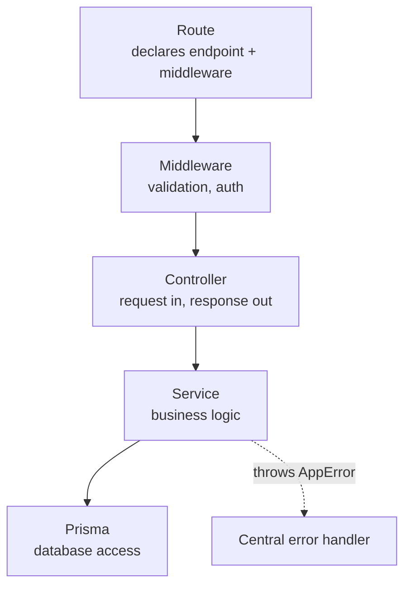
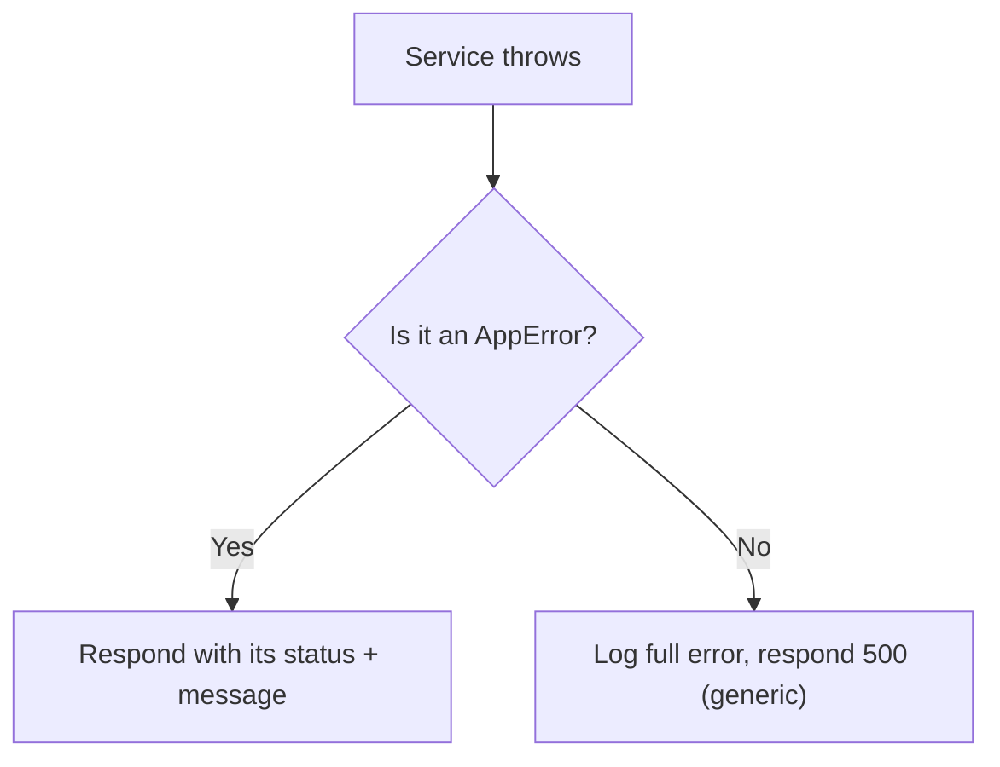

# Backend

> How the DevFlow backend is structured, the patterns every module follows, and how to add a new one.
> Related: [architecture.md](architecture.md) · [authentication.md](authentication.md) · [database.md](database.md) · [folder-structure.md](folder-structure.md) · [coding-guidelines.md](coding-guidelines.md)

---

## Purpose

This is the guide a backend engineer reads before writing code. It explains the layers a request passes through, what each layer is allowed to do, and the shared building blocks (errors, responses, validation) that keep every module consistent. If you follow the patterns here, a new module will look and behave like the existing one.

---

## Overview

The backend is a Node.js and Express application written in TypeScript. It is a **modular monolith**: one application, divided into independent feature modules. See [architecture.md](architecture.md) for the reasoning.

Each feature lives in its own folder under `src/modules/` and is built from four files that map to four responsibilities:

| File | Responsibility |
|---|---|
| `*.routes.ts` | Declares the endpoints and the middleware order |
| `*.controller.ts` | Reads the request and sends the response |
| `*.service.ts` | Business logic and database access |
| `*.validation.ts` | Zod schemas describing valid input |

The **auth** and **workspace** modules are implemented; the workspace module also adds the `authorize()` RBAC middleware (see [workspace.md](workspace.md)). The remaining module folders are placeholders.

---

## Folder Structure

```text
backend/src/
├── index.ts               # Entry point: middleware, route mounting, error handlers
├── config/
│   ├── env.ts             # Reads and validates environment variables at startup
│   └── prisma.ts          # The single PrismaClient instance
├── middleware/
│   ├── auth.middleware.ts     # Verifies the JWT, attaches req.user
│   ├── authorize.middleware.ts # Workspace-scoped RBAC: checks role, attaches req.membership
│   ├── validate.middleware.ts # Validates the request body with a Zod schema
│   └── error.middleware.ts    # Central error handler and 404 handler
├── utils/
│   ├── app-error.ts       # AppError class and status-code factory functions
│   ├── async-handler.ts   # Wraps async handlers so errors reach the error handler
│   ├── jwt.ts             # Signs and verifies access tokens
│   └── response.ts        # Builds the standard success response
└── modules/
    └── auth/
        ├── auth.routes.ts
        ├── auth.controller.ts
        ├── auth.service.ts
        └── auth.validation.ts
```

A full explanation of each folder is in [folder-structure.md](folder-structure.md).

---

## The Layers

A request flows through the layers in one direction. Each layer only talks to the next one in.



The rule that keeps this clean: **a layer never skips ahead or reaches back.** Controllers do not run queries; services do not read `req` or write `res`; routes contain no logic.

---

## Routes

The route file is a table of contents for a module. It maps a URL and HTTP method to a chain of middleware and a controller. It contains no logic.

```typescript
// modules/auth/auth.routes.ts
const router = Router();

router.post("/register", validate(registerSchema), register);
router.post("/login", validate(loginSchema), login);
router.get("/me", authenticate, me);

export default router;
```

Reading each line tells you the full story of an endpoint: validate the body, then run the controller; or authenticate first, then run the controller. The router is mounted in [index.ts](../backend/src/index.ts) under a base path (`/api/auth`).

> [!NOTE]
> **Middleware order matters.** Middleware runs left to right. `validate(registerSchema)` runs before `register`, so the controller only ever sees valid input. `authenticate` runs before `me`, so `me` can rely on `req.user` existing.

---

## Controller Pattern

A controller is the boundary between HTTP and the application. Its only jobs are: read what it needs from the request, call a service, and send the response. It holds no business logic, so it stays short.

```typescript
// modules/auth/auth.controller.ts
export const register = asyncHandler(async (req: Request, res: Response) => {
  const result = await registerUser(req.body);
  sendSuccess(res, result, 201);
});
```

Two things make this possible:

- **`asyncHandler`** wraps the function so that if the service throws (or a promise rejects), the error is passed to the central error handler automatically. This removes the repetitive `try/catch` block that would otherwise appear in every controller.
- **`sendSuccess`** builds the standard response envelope, so every endpoint returns the same shape.

> [!TIP]
> If you find yourself writing an `if`/`else` about business rules inside a controller, that logic belongs in the service. The controller should read almost like a description of the HTTP contract.

---

## Service Pattern

The service is where the actual work happens. It contains the business rules and is the **only layer that talks to the database** (through Prisma). Services are plain functions that take and return data — they know nothing about HTTP, which makes them easy to reuse and to test.

```typescript
// modules/auth/auth.service.ts
export const registerUser = async ({ name, email, password }: RegisterInput) => {
  const existing = await prisma.user.findUnique({ where: { email } });
  if (existing) {
    throw Conflict("An account with this email already exists");
  }

  const passwordHash = await bcrypt.hash(password, env.BCRYPT_SALT_ROUNDS);

  const user = await prisma.user.create({
    data: { name, email, passwordHash },
    select: publicUserSelect,
  });

  const token = signAccessToken({ sub: user.id, email: user.email });
  return { user, token };
};
```

Note what the service does and does not do:

- It **throws** an `AppError` (`Conflict(...)`) instead of sending a response. Deciding the HTTP status is not its job — that is handled centrally.
- It uses a Prisma `select` (`publicUserSelect`) so sensitive fields such as the password hash can never be returned.
- It receives already-validated, typed input (`RegisterInput`), so it does not re-check the shape of the data.

---

## Validation

Every request body is validated at the edge, before any controller or service runs, using [Zod](https://zod.dev). A module declares its schemas in `*.validation.ts`:

```typescript
// modules/auth/auth.validation.ts
export const registerSchema = z.object({
  name: z.string().trim().min(2).max(60),
  email: z.string().trim().toLowerCase().email(),
  password: z.string().min(8).max(128),
});

export type RegisterInput = z.infer<typeof registerSchema>;
```

The `validate` middleware runs a schema against `req.body`. If the data is invalid, it responds with `400` and a list of field errors. If it is valid, it replaces `req.body` with the parsed (and transformed, for example lower-cased email) data and calls the next handler.

```typescript
// middleware/validate.middleware.ts
export const validate = (schema: ZodSchema) => (req, res, next) => {
  const result = schema.safeParse(req.body);
  if (!result.success) {
    return res.status(400).json({
      success: false,
      errors: result.error.flatten().fieldErrors,
    });
  }
  req.body = result.data;
  next();
};
```

> [!TIP]
> The `z.infer` line means the schema is the single source of truth. The service's input type (`RegisterInput`) is derived from the schema, so validation and types can never drift apart.

---

## Database Access

All database access goes through Prisma, and only from within services. A single `PrismaClient` instance is created and shared:

```typescript
// config/prisma.ts
export const prisma = new PrismaClient();
```

Guidelines:

- **Select only what is needed.** Use a `select` clause to avoid returning sensitive or unnecessary fields. The auth service defines a `publicUserSelect` that lists exactly the fields safe to expose.
- **Rely on database constraints.** The unique constraint on `User.email` is the real guarantee against duplicates; the application check is a friendlier message on top of it.
- **Keep queries in services.** A controller that imports `prisma` is a sign logic is in the wrong layer.

The schema and relationships are documented in [database.md](database.md).

---

## Error Handling

Errors are handled in **one place**, not in every controller. This is what makes controllers short and error responses consistent.

There are two kinds of error:

1. **Expected (operational) errors** — bad input, wrong password, missing record. These are thrown as an `AppError` with an HTTP status.
2. **Unexpected errors** — bugs, a database being down. These are caught, logged in full, and returned as a generic `500` so no internal detail leaks to the client.

```typescript
// utils/app-error.ts
export class AppError extends Error {
  constructor(public message: string, public statusCode: number) {
    super(message);
    this.isOperational = true;
  }
}
export const Conflict = (msg: string) => new AppError(msg, 409);
export const Unauthorized = (msg = "Unauthorized") => new AppError(msg, 401);
// ... BadRequest, Forbidden, NotFound
```

The central handler, registered last in [index.ts](../backend/src/index.ts), formats the response:

```typescript
// middleware/error.middleware.ts
export const errorHandler = (err, _req, res, _next) => {
  if (err instanceof AppError) {
    return res.status(err.statusCode).json({ success: false, message: err.message });
  }
  console.error("Unhandled error:", err);
  res.status(500).json({ success: false, message: "Internal server error" });
};
```



> [!WARNING]
> Never send a raw error message or stack trace to the client. Internal details help attackers and confuse users. Throw an `AppError` with a safe message, and let unexpected errors fall through to the generic `500`.

---

## Configuration

Configuration is read from environment variables and **validated once at startup** in [config/env.ts](../backend/src/config/env.ts) using Zod. If a required value is missing or invalid (for example, a `JWT_SECRET` shorter than 32 characters), the process prints a clear message and exits, rather than failing unpredictably later.

```typescript
const envSchema = z.object({
  DATABASE_URL: z.string().min(1),
  JWT_SECRET: z.string().min(32, "JWT_SECRET must be at least 32 characters"),
  BCRYPT_SALT_ROUNDS: z.coerce.number().int().min(10).max(15).default(12),
  // ...
});
```

Application code imports the validated `env` object and never reads `process.env` directly. The variables are documented in the [README](../README.md#environment-variables).

---

## Logging

Today logging uses `console.log` and `console.error`. This is acceptable for early development but is a known limitation: the output is unstructured and hard to search or correlate.

**Planned improvement:** a structured logger (for example, [pino](https://getpino.io)) that emits JSON logs, attaches a request ID to each log line, and separates log levels. This is listed under [Future Improvements](#future-improvements).

---

## Adding a New Module

To add a feature, copy the shape of the auth module. For a module called `project`:

1. Create `src/modules/project/` with `project.routes.ts`, `project.controller.ts`, `project.service.ts`, and `project.validation.ts`.
2. Define Zod schemas in the validation file and export their inferred types.
3. Write services as plain functions that take validated input, contain the logic, use Prisma, and throw `AppError` on failure.
4. Write thin controllers wrapped in `asyncHandler` that call services and use `sendSuccess`.
5. Declare routes, applying `validate(...)` and `authenticate` as needed.
6. Mount the router in [index.ts](../backend/src/index.ts), after the global middleware and before the error handler:

```typescript
app.use("/api/projects", authenticate, projectRoutes);
```

Do not import another module's internal files. If two modules need to share logic, expose it through a service function. See [coding-guidelines.md](coding-guidelines.md).

---

## Design Decisions

| Decision | Choice | Rationale |
|---|---|---|
| Module shape | Four files per feature | Predictable; a feature lives in one folder |
| Controller scope | HTTP only, no logic | Short, readable, easy to change |
| Service scope | Logic and the only DB access | Reusable and testable in isolation |
| Async errors | `asyncHandler` wrapper | Removes repeated `try/catch` |
| Errors | `AppError` + central handler | One response shape; no leaked internals |
| Validation | Zod at the edge, types inferred | Input checked once; types cannot drift |
| Config | Validated env, fail fast | Misconfiguration caught at startup |

---

## Tradeoffs

- **Four files per feature** is slight overhead for a tiny module, but the consistency pays off as the codebase grows.
- **Plain functions over classes** for services keeps things simple; if a service later needs shared setup, it can be refactored without changing the calling code much.
- **Central error handling** means a new engineer must learn to *throw* rather than *respond* — a small learning curve for a large consistency gain.

---

## Future Improvements

- Structured logging (pino) with request IDs.
- A shared `AsyncHandler`-aware validation for params and query, not just the body.
- Automated tests for services and routes (for example, Vitest and Supertest); there are currently none.
- Route the validation middleware's error through `AppError` so every error uses one path.
- ~~Role-based access control middleware once workspaces are built~~ — done: `authorize()`, workspace-scoped (see [workspace.md](workspace.md)).

---

## Best Practices

- Keep controllers thin; put logic in services.
- Access the database only from services.
- Validate input at the edge and derive types from the schema.
- Throw `AppError` for expected failures; never send raw errors to the client.
- Import shared code from `utils/` and `config/`, never from another module's internals.
- Read configuration from the validated `env` object, never from `process.env` directly.

---

## Developer Notes

- Remaining module folders (project, task, chat, etc.) are empty. Use **auth** and **workspace** as reference implementations — workspace shows the pattern for a resource with nested members and RBAC.
- Express 5 forwards rejected promises to the error handler automatically, but `asyncHandler` is kept for clarity and portability.
- The `me` endpoint fetches the user fresh from the database rather than trusting the token payload, so profile changes and deactivations take effect immediately.

---

_Next: [authentication.md](authentication.md) — the auth module and its security model in depth._
