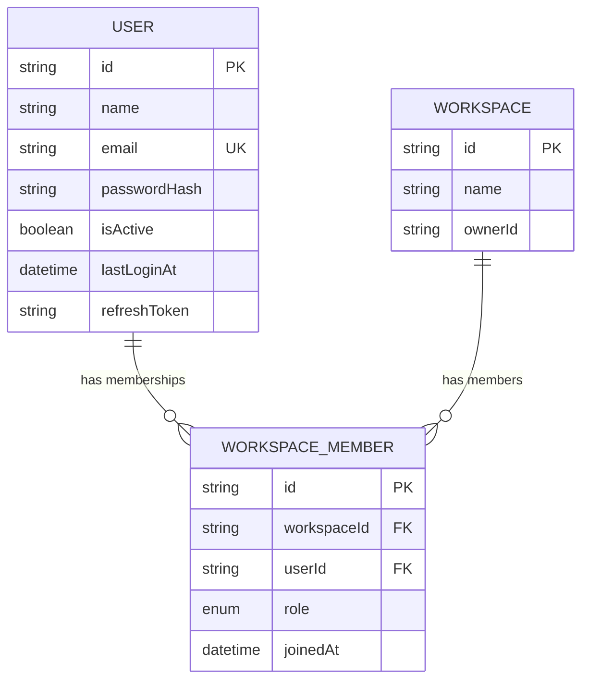
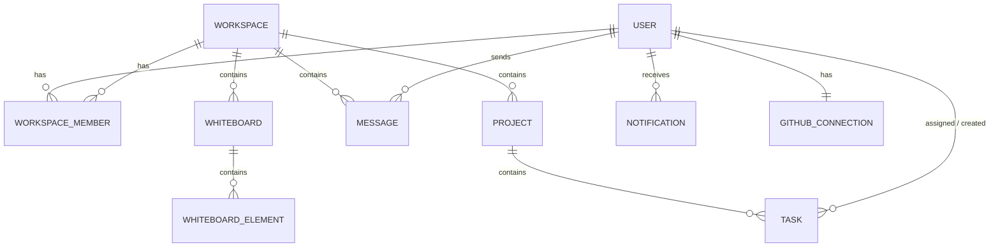

# Database

> The DevFlow data model: the Prisma schema, the models that exist today, their relationships, and how migrations work.
> Related: [backend.md](backend.md) · [authentication.md](authentication.md) · [architecture.md](architecture.md)

---

## Purpose

This document describes the database as it actually is, and the shape it is planned to grow into. It is the reference for anyone adding a model or writing a query. The database is PostgreSQL, and it is accessed only through Prisma from within services (see [backend.md](backend.md)).

---

## Overview

- **Database:** PostgreSQL 14 or newer.
- **Toolkit:** [Prisma](https://www.prisma.io) — the schema in `prisma/schema.prisma` is the single source of truth, migrations are versioned SQL, and queries are type-safe.
- **Identifiers:** every model uses a `cuid()` string as its primary key. CUIDs are collision-resistant and non-sequential, so ids do not leak record counts or ordering.
- **Timestamps:** models carry `createdAt` and `updatedAt`, managed by Prisma.

> [!IMPORTANT]
> Only three models exist today: `User`, `Workspace`, and `WorkspaceMember` (plus the `WorkspaceRole` enum). Everything else on the [product roadmap](roadmap.md) — Project, Task, Message, Whiteboard, Notification, and so on — is **planned** and not yet in the schema. This document marks each clearly.

---

## Current Schema

```prisma
model User {
  id           String            @id @default(cuid())
  name         String
  email        String            @unique
  passwordHash String
  avatar       String?
  bio          String?
  githubUrl    String?
  linkedinUrl  String?
  isActive     Boolean           @default(true)
  createdAt    DateTime          @default(now())
  updatedAt    DateTime          @updatedAt
  lastLoginAt  DateTime?
  refreshToken String?
  memberships  WorkspaceMember[]
}

model Workspace {
  id          String            @id @default(cuid())
  name        String
  description String?
  ownerId     String
  createdAt   DateTime          @default(now())
  updatedAt   DateTime          @updatedAt
  members     WorkspaceMember[]
}

model WorkspaceMember {
  id          String        @id @default(cuid())
  workspaceId String
  userId      String
  role        WorkspaceRole @default(MEMBER)
  joinedAt    DateTime      @default(now())
  user        User          @relation(fields: [userId], references: [id])
  workspace   Workspace     @relation(fields: [workspaceId], references: [id])

  @@unique([workspaceId, userId])
}

enum WorkspaceRole {
  OWNER
  ADMIN
  MEMBER
}
```

---

## Entity Relationship Diagram (Current)



`WorkspaceMember` is a **join table**. A user can belong to many workspaces, and a workspace can have many members; the join table represents that many-to-many relationship and also stores each member's role.

---

## Relationships and Constraints

| Relationship | Type | How it is enforced |
|---|---|---|
| User ↔ Workspace | Many-to-many | Through `WorkspaceMember` |
| WorkspaceMember → User | Many-to-one | `userId` foreign key |
| WorkspaceMember → Workspace | Many-to-one | `workspaceId` foreign key |
| One membership per user per workspace | Uniqueness | `@@unique([workspaceId, userId])` |
| One account per email | Uniqueness | `@unique` on `User.email` |

> [!NOTE]
> `Workspace.ownerId` currently records the owner as a plain field, not a formal foreign-key relation to `User`. Making it a proper relation is a small planned refinement once the workspace module is built.

---

## Indexes

Indexes make lookups fast. The current schema has these, created automatically by Prisma:

- **Primary keys** on every `id`.
- **`User.email`** — unique, and used on every login and registration lookup.
- **`WorkspaceMember(workspaceId, userId)`** — the unique composite, which also speeds up membership checks.

> [!TIP]
> The rule going forward: add an index whenever a query filters, sorts, or joins on a column. For example, when the Task model arrives, `Task.projectId` and `Task.assigneeId` will need indexes because tasks are constantly listed by project and by assignee.

---

## Planned Schema

The models below are on the roadmap and are shown here so the data model's direction is clear. They are **not yet implemented**.



| Planned model | Purpose |
|---|---|
| `Project` | Groups tasks inside a workspace |
| `Task` | A unit of work with status, priority, assignee, due date |
| `Message` | A chat message in a workspace |
| `Whiteboard` / `WhiteboardElement` | A canvas and the shapes on it |
| `Notification` | An event for a user, with read state |
| `GithubConnection` | A user's linked GitHub account and token |

These will follow the same conventions: `cuid()` ids, timestamps, foreign keys with matching indexes, and enums for fixed value sets (task status, priority, notification type).

---

## Migrations

Prisma migrations are versioned SQL files in `prisma/migrations/`. Two exist so far:

| Migration | Contents |
|---|---|
| `..._init` | Created `User`, `Workspace`, `WorkspaceMember`, and the `WorkspaceRole` enum |
| `..._auth_fields` | Added authentication-related fields to `User` |

**Workflow:**

```bash
# After editing schema.prisma, create and apply a migration in development
npm run prisma:migrate      # prisma migrate dev

# Regenerate the type-safe client (also runs as part of migrate)
npm run prisma:generate

# In production, apply existing migrations without generating new ones
npx prisma migrate deploy
```

> [!WARNING]
> Never edit a migration that has already been applied to a shared or production database. Create a new migration instead. Changing applied migrations puts environments out of sync.

---

## Design Decisions

| Decision | Choice | Rationale |
|---|---|---|
| Primary keys | `cuid()` strings | Non-sequential; do not leak counts or order |
| Many-to-many | Explicit join table (`WorkspaceMember`) | Lets the relationship carry data (role, joinedAt) |
| Fixed value sets | Enums (`WorkspaceRole`) | Type-safe and self-documenting |
| Uniqueness | Database constraints | The real guarantee, not just app checks |
| Schema location | One `schema.prisma` | Single source of truth for the model |

---

## Tradeoffs

- **CUID vs auto-increment integers:** CUIDs are safer to expose and easier to merge across systems, at the cost of slightly larger keys. For this application the safety is worth it.
- **Explicit join table** adds a model, but it is what allows a membership to have a role and a join date — a plain implicit relation could not.
- **Prisma** gives excellent type safety; genuinely complex queries occasionally need raw SQL, which Prisma supports when needed.

---

## Scalability

The near-term scaling levers are covered in [system-design.md](system-design.md#database-scaling): add indexes as query patterns appear, introduce connection pooling once there is more than one backend instance, then read replicas for read-heavy load, and partitioning for very large tables such as messages. None of this changes the schema; it changes how the database is deployed.

---

## Best Practices

- Access the database only from services, never from controllers.
- Use a Prisma `select` to return only the fields a response needs, and never select `passwordHash` or `refreshToken`.
- Add an index whenever a new query filters, sorts, or joins on a column.
- Enforce real invariants with database constraints, not only application code.
- Create a new migration for every schema change; never edit an applied one.

---

## Developer Notes

- `passwordHash` and `refreshToken` are sensitive columns on `User`. The auth service uses a `publicUserSelect` that excludes them (see [authentication.md](authentication.md)).
- `refreshToken` exists but is unused; it is reserved for the planned refresh-token flow.
- `isActive` supports deactivating accounts; the `/me` endpoint reads the live record so a deactivation takes effect immediately.
- Open `npm run prisma:studio` to browse and edit the database visually during development.

---

_Next: [api.md](api.md) — API conventions, response format, and endpoints._
