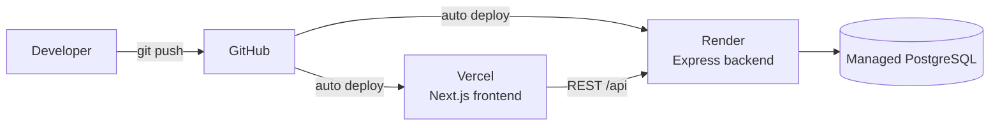

# Deployment

> How DevFlow is deployed: the frontend on Vercel, the backend on Render, and PostgreSQL as a managed database.
> Related: [architecture.md](architecture.md) · [system-design.md](system-design.md) · [README](../README.md#environment-variables)

---

## Purpose

This document explains how to deploy DevFlow and what each platform is responsible for. It reflects the intended deployment setup; adjust the specifics to your accounts and providers.

---

## Overview



| Component | Platform | Responsibility |
|---|---|---|
| Frontend | Vercel | Builds and serves the Next.js app |
| Backend | Render | Runs the Express API |
| Database | Managed PostgreSQL | Stores all application data |

Both platforms deploy from GitHub: pushing to the main branch triggers a build and deploy.

---

## Prerequisites

- A GitHub repository containing this project.
- A Vercel account (frontend) and a Render account (backend).
- A managed PostgreSQL database (Render offers one; any provider works) and its connection URL.

---

## Backend (Render)

1. Create a new **Web Service** on Render, connected to the repository, with the root directory set to `backend`.
2. Configure the commands:
   - **Build:** `npm install && npm run build`
   - **Start:** `npm start`
3. Set the environment variables (see [Environment Variables](#environment-variables)).
4. Run database migrations against the production database (see [Database Migrations](#database-migrations)).

The backend compiles TypeScript to `dist/` during build and runs the compiled output with `npm start`. The server validates its environment at startup and will refuse to start if anything required is missing.

> [!TIP]
> Point a health check at `/health`. It returns quickly and confirms the process is up.

---

## Frontend (Vercel)

1. Import the repository into Vercel and set the root directory to `frontend`.
2. Vercel detects Next.js automatically; the default build (`npm run build`) and output settings work.
3. Set any frontend environment variables (for example, the backend API base URL) in the Vercel project settings.
4. Each pull request gets a preview deployment; the main branch deploys to production.

---

## Database Migrations

Migrations must be applied to the production database whenever the schema changes. Use the deploy command, which applies existing migrations without creating new ones:

```bash
npx prisma migrate deploy
```

Run this as part of the backend's release step, or manually against the production `DATABASE_URL`. Do not use `prisma migrate dev` in production — that command is for creating migrations during development.

> [!WARNING]
> Always back up the production database before applying migrations, and never edit a migration that has already been applied. See [database.md](database.md#migrations).

---

## Environment Variables

Set these on the backend host (Render). They are validated at startup.

| Variable | Notes |
|---|---|
| `NODE_ENV` | Set to `production` |
| `PORT` | Often provided by the platform |
| `CORS_ORIGIN` | The deployed frontend URL (for example, the Vercel domain) |
| `DATABASE_URL` | The managed PostgreSQL connection string |
| `JWT_SECRET` | A strong secret, at least 32 characters |
| `JWT_EXPIRES_IN` | For example, `7d` |
| `BCRYPT_SALT_ROUNDS` | For example, `12` |

Full descriptions are in the [README](../README.md#environment-variables).

> [!WARNING]
> Never commit secrets. Set them through each platform's environment settings. Use different secrets for production than for development.

---

## Post-Deployment Checks

After a deploy, confirm:

- `GET /health` on the backend returns `{ "success": true, "data": { "status": "ok" } }`.
- Registration and login work end to end from the deployed frontend.
- The backend logs show it started with the expected `NODE_ENV`.
- CORS allows the deployed frontend origin (no browser CORS errors).

---

## Design Decisions

| Decision | Choice | Rationale |
|---|---|---|
| Frontend host | Vercel | First-class Next.js support, preview deploys |
| Backend host | Render | Simple Node hosting with managed PostgreSQL |
| Deploy trigger | Git push | Straightforward, no extra tooling |
| Config | Platform environment variables | Secrets stay out of the repository |

---

## Scalability

The deployment maps directly onto the scaling plan in [system-design.md](system-design.md): the backend is stateless, so it can run as multiple instances behind the platform's load balancing; Redis, a job queue, and read replicas are added there as load requires. None of that changes the deployment model described here.

---

## Future Improvements

- A CI pipeline that runs typecheck and tests before deploy.
- Automated migration runs as part of the release step.
- Containerisation (Docker) for reproducible environments.
- Separate staging and production environments.

---

## Best Practices

- Keep production secrets separate from development and out of version control.
- Apply migrations with `migrate deploy`, after a backup.
- Verify `/health` and a real login after every deploy.
- Set `CORS_ORIGIN` to the exact deployed frontend origin.

---

## Developer Notes

- The backend build output is `dist/`; `npm start` runs `node dist/index.js`.
- The server exits at startup if the environment is invalid — check the logs first if a deploy fails to boot.
- There is no CI pipeline yet; the checks above are manual for now.

---

_Next: [development-workflow.md](development-workflow.md) — branching, commits, and pull requests._
