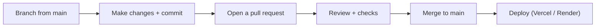

# Development Workflow

> How work moves from an idea to deployed code: branching, commits, pull requests, review, and merge.
> Related: [contributing.md](contributing.md) · [coding-guidelines.md](coding-guidelines.md) · [deployment.md](deployment.md)

---

## Purpose

This document describes the day-to-day process for making changes. Following it keeps the history readable, keeps `main` deployable, and makes reviews quick.

---

## Overview



The main branch is always in a deployable state. All work happens on short-lived branches and enters `main` through a reviewed pull request.

---

## Branching

Create a branch from `main` for each piece of work. Name it by type and a short description.

| Prefix | Use for | Example |
|---|---|---|
| `feature/` | New functionality | `feature/workspace-invites` |
| `fix/` | Bug fixes | `fix/login-timing` |
| `refactor/` | Restructuring without behaviour change | `refactor/auth-service` |
| `docs/` | Documentation only | `docs/api-reference` |
| `chore/` | Tooling, dependencies, config | `chore/add-eslint` |

Keep branches small and focused on one change. Small branches are reviewed faster and merged sooner.

---

## Commits

Use [Conventional Commits](https://www.conventionalcommits.org). The format is:

```text
<type>(<scope>): <short summary>
```

| Type | Meaning |
|---|---|
| `feat` | A new feature |
| `fix` | A bug fix |
| `refactor` | Code change that neither fixes a bug nor adds a feature |
| `docs` | Documentation only |
| `chore` | Build, tooling, or dependency changes |
| `test` | Adding or fixing tests |

Examples:

```text
feat(auth): add refresh token rotation
fix(auth): keep login constant-time for unknown emails
docs(database): document migration workflow
```

> [!TIP]
> Write the summary in the imperative mood ("add", "fix", not "added", "fixed") and keep it under about 70 characters. Put extra detail in the commit body if needed.

---

## Pull Requests

1. Push your branch and open a pull request against `main`.
2. Describe **what** changed and **why**. Link any related issue.
3. Keep the PR focused. If it grows to cover several concerns, split it.
4. Make sure checks pass before requesting review (see below).

A good PR description saves the reviewer time and becomes part of the project's history.

---

## Checks Before Review

Run these locally before asking for review:

```bash
# backend
npm run typecheck     # types must pass
# npm test            # once tests exist
```

> [!NOTE]
> There is no automated CI pipeline yet, so these checks are currently manual. Adding CI is a planned improvement (see [deployment.md](deployment.md#future-improvements)).

---

## Review and Merge

- At least one reviewer approves the change.
- The reviewer checks correctness, that it follows [coding-guidelines.md](coding-guidelines.md), and that it does not leak secrets or weaken security.
- Once approved and checks pass, merge into `main`.
- Merging to `main` triggers deployment (see [deployment.md](deployment.md)).

---

## Design Decisions

| Decision | Choice | Rationale |
|---|---|---|
| Branch model | Short-lived branches off `main` | Simple; keeps `main` deployable |
| Commit format | Conventional Commits | Readable history; enables changelogs later |
| Merge gate | Review + passing checks | Catches issues before `main` |

---

## Best Practices

- One concern per branch and per pull request.
- Commit often locally; keep each commit coherent.
- Run typecheck before opening a PR.
- Write PR descriptions that explain the reasoning, not just the diff.
- Rebase or update from `main` if your branch falls behind.

---

## Developer Notes

- `main` is the branch used for production deploys; do not commit directly to it.
- Conventional Commit types line up with the branch prefixes, which keeps intent consistent from branch to history.
- Until CI exists, reviewers should confirm the author ran typecheck.

---

_Next: [coding-guidelines.md](coding-guidelines.md) — code style and conventions._
