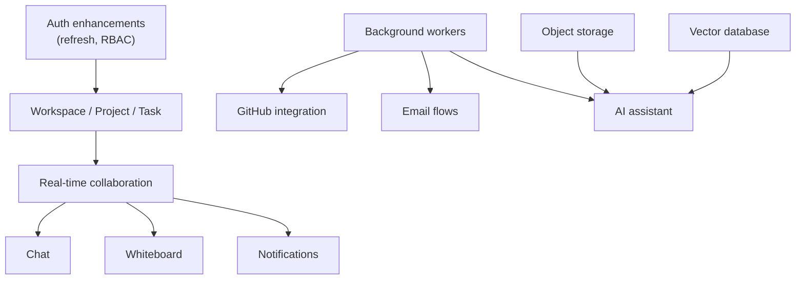

# Future Features

> A closer look at the planned features: what each one is, how it is expected to work, and what it depends on.
> Related: [roadmap.md](roadmap.md) · [architecture.md](architecture.md) · [system-design.md](system-design.md) · [database.md](database.md)

---

## Purpose

The [roadmap](roadmap.md) lists what is planned; this document explains each planned feature in more depth so the design is clear before work begins. Nothing here is implemented yet.

> [!IMPORTANT]
> Every feature in this document is **planned**. The descriptions are design intent and will be refined when the work actually starts.

---

## Authentication Enhancements

### Refresh tokens and logout

**Problem:** access tokens are stateless and cannot be revoked before they expire (see [authentication.md](authentication.md)).

**Plan:** issue a short-lived access token plus a longer-lived refresh token. The refresh token is stored (the `User.refreshToken` field is reserved for this) and can be rotated on use and revoked on logout. This enables real logout and limits the damage of a leaked access token.

**Depends on:** nothing new; builds on the existing auth module.

### Role-based access control (RBAC)

**Plan:** a `requireRole` middleware that checks a user's role in a workspace (`OWNER`, `ADMIN`, `MEMBER`) before allowing an action. It composes with `authenticate`, the same way validation composes with controllers.

**Depends on:** the workspace module.

### Email verification and password reset

**Plan:** email-based verification on registration and a reset-by-email flow. Both send email, which should run as a background job, and use short-lived codes suited to Redis with a TTL.

**Depends on:** background workers and an email provider.

---

## Workspace, Project, and Task Modules

These are the core collaboration features and the next major work.

- **Workspaces:** create and manage a workspace, invite members, and assign roles. Models already exist ([database.md](database.md)).
- **Projects:** group work inside a workspace.
- **Tasks:** a Kanban board with status (`TODO`, `IN_PROGRESS`, `REVIEW`, `DONE`), priority, an assignee, and a due date.

Each follows the module pattern in [backend.md](backend.md): routes, controller, service, validation, with new Prisma models and matching indexes.

**Depends on:** RBAC for permissions; the frontend for the board UI.

---

## Real-Time Collaboration

**Plan:** Socket.IO with one room per workspace, so updates reach only that workspace's members. This underlies chat, presence, and live task and whiteboard updates.

**Scaling:** across multiple backend instances, a Redis adapter shares socket state so a message from one instance reaches clients on another (see [system-design.md](system-design.md#socket-scaling)).

**Depends on:** the workspace module; Redis for multi-instance scaling.

---

## Chat

**Plan:** per-workspace messaging with real-time delivery, online presence, and typing indicators. Messages are stored in PostgreSQL and broadcast over Socket.IO.

**Depends on:** real-time collaboration; a `Message` model.

---

## Whiteboard

**Plan:** a shared canvas with shapes, text, and sticky notes, edited by several users at once. Elements are stored (a `Whiteboard` and `WhiteboardElement` model) and synchronised over Socket.IO.

**Depends on:** real-time collaboration.

---

## GitHub Integration

**Plan:** sign in with GitHub (OAuth), link a GitHub account (a `GithubConnection` model holds the token), and sync repositories, pull requests, and issues into the workspace. Show commit activity.

**Scaling:** GitHub's API is rate-limited and responses can be large, so syncing runs as a background job, not in the request (see [system-design.md](system-design.md#queues-and-background-workers)).

**Depends on:** background workers; secure token storage.

---

## Notifications

**Plan:** an in-app notification feed with read/unread state, covering task assignments, project updates, and GitHub events. Delivered in real time where a user is connected.

**Depends on:** real-time collaboration; a `Notification` model; background fan-out for bulk events.

---

## AI Assistant and Document Processing

**Plan:** a separate service (FastAPI + LangChain) that answers questions and summarises workspace content. Documents are processed through a pipeline — upload, split into chunks, generate embeddings, and store them in a vector database — so the assistant can retrieve relevant content.

**Why a separate service:** it is a different language (Python) and runtime profile, and is the natural first candidate to run independently (see [architecture.md](architecture.md#future-microservices)).

**Depends on:** object storage for uploads; a vector database; background workers for embedding generation.

---

## Video Meetings

**Plan:** in-workspace calls using WebRTC, for discussions without leaving DevFlow. This is a long-term item and the most involved technically.

**Depends on:** signalling infrastructure and, likely, media servers.

---

## Platform and Infrastructure

Supporting work that makes the features above production-ready:

- **Object storage** for avatars and attachments ([system-design.md](system-design.md#file-storage)).
- **Background workers and a queue** for slow and external work.
- **Redis** for caching, shared rate limiting, and socket scaling.
- **Automated tests and CI** to protect against regressions.
- **Structured logging** with request IDs.
- **Containerisation and a staging environment.**

---

## Dependencies at a Glance

---

## Developer Notes

- Reserved pieces already exist for the nearest work: `User.refreshToken` and the `WorkspaceRole` enum.
- Add new models with the conventions in [database.md](database.md): `cuid()` ids, timestamps, foreign keys with indexes, and enums for fixed value sets.
- Build slow or external-dependent work as background jobs from the start, rather than retrofitting it later.

---

_Back to: [roadmap.md](roadmap.md) · [README](../README.md)_
