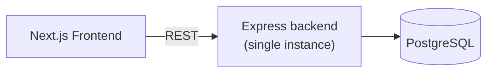
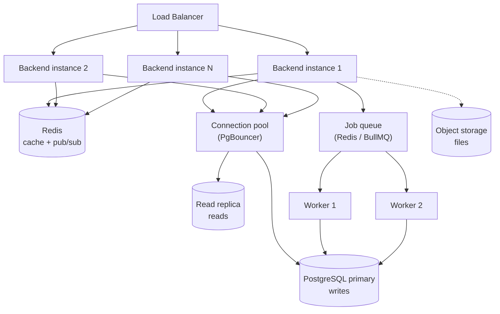
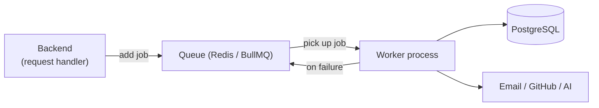
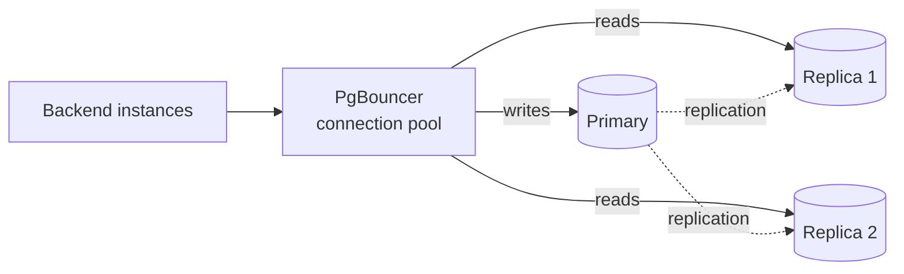
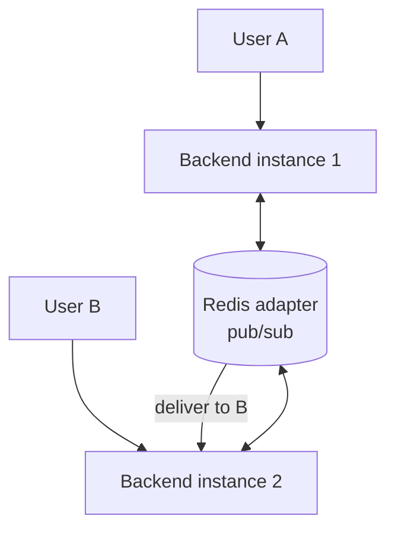

# System Design

> How DevFlow runs today, and the concrete plan for scaling it as usage and features grow.
> Related: [architecture.md](architecture.md) · [database.md](database.md) · [backend.md](backend.md) · [deployment.md](deployment.md)

---

## Purpose

[architecture.md](architecture.md) describes *what the pieces are*. This document describes *how the system behaves under load and how it will scale*. It covers caching, queues, background workers, and horizontal, database, socket, and storage scaling.

> [!IMPORTANT]
> Almost everything past [Current Design](#current-design) is **forward-looking**. DevFlow today is a single backend instance talking to one PostgreSQL database, serving only the authentication module. The scaling sections describe the intended path, not running infrastructure. They are written now so that decisions made today do not block that path later.

---

## Overview

The guiding principle is **scale the simple thing first**. DevFlow starts as a modular monolith (explained in [architecture.md](architecture.md)) and stays that way for as long as possible. Scaling happens in a deliberate order, and each step is only taken when a real bottleneck appears:

1. Run more copies of the stateless backend (horizontal scaling).
2. Add Redis for caching and shared state.
3. Scale the database (pooling, indexes, then read replicas).
4. Move slow work off the request path into background workers.
5. Scale realtime (Socket.IO) across instances.
6. Move large files to object storage.

Each of these is explained below.

---

## Current Design

| Concern | Today |
|---|---|
| Backend instances | One |
| State | Stateless (JWT auth, no server session store) |
| Database | One PostgreSQL instance |
| Cache | None |
| Queues / workers | None |
| Realtime | Not connected |
| File storage | None |

The backend is already **stateless**, which is the single most important property for scaling. Because a JWT carries the user's identity, any instance can serve any request without needing shared session memory. This is what makes horizontal scaling straightforward later.

---

## Scaling Strategy

The diagram below shows the target shape once the main scaling steps are in place. Every element except the backend and PostgreSQL is planned.

The order matters. Adding a load balancer is cheap and comes first. Splitting the database or extracting services is expensive and comes only when measurements demand it.

---

## Horizontal Scaling

**What it is:** running several identical copies of the backend behind a load balancer, which spreads incoming requests across them.

**Why DevFlow can do this easily:** the backend keeps no per-user state in memory. There is no session stored on a specific server, so it does not matter which instance handles a given request.

**What to watch for as instances multiply:**

- **Rate limiting.** The current rate limiter counts requests in the memory of one instance. With several instances, the count must be shared — this moves to Redis (see [Redis](#redis)).
- **Realtime.** Socket connections are held open on one instance; broadcasting to users on other instances needs a shared adapter (see [Socket Scaling](#socket-scaling)).
- **Database connections.** More instances means more connections to PostgreSQL, which has a connection limit — this is why a connection pool is needed (see [Database Scaling](#database-scaling)).

---

## Caching

**What it is:** storing the result of an expensive or frequent operation so it does not have to be recomputed on every request.

**Where DevFlow will use it:**

| Cache use | Example | Benefit |
|---|---|---|
| Hot reads | A workspace's member list | Fewer repeated database queries |
| Derived data | Task counts, dashboards | Avoids recomputing on every load |
| Rate-limit counters | Requests per IP | Shared limit across all instances |
| Short-lived tokens | Password reset codes | Automatic expiry |

**Approach:** cache read-heavy, slow-changing data with a time-to-live (TTL), and remove or update the cached value when the underlying data changes. Caching is added per feature when a query is measurably hot, not preemptively.

> [!TIP]
> A cache is only worth adding when a query is both frequent and slow, or when the same data is requested far more often than it changes. Caching everything creates correctness bugs (stale data) without a matching benefit.

---

## Redis

**What it is:** an in-memory data store, extremely fast, used for caching and for sharing small pieces of state between backend instances.

Redis is the backbone of several scaling steps because it is shared across all instances:

- **Cache** — the store behind the [Caching](#caching) section.
- **Shared rate limiting** — one request count that every instance reads and updates.
- **Socket.IO adapter** — lets a message sent from one instance reach clients connected to another (see [Socket Scaling](#socket-scaling)).
- **Job queue backing store** — the queue in [Background Workers](#background-workers) can be backed by Redis.

> [!NOTE]
> The `redis` and `ioredis` packages are already installed in the backend but are **not connected to any code yet**.

---

## Queues and Background Workers

**The problem they solve:** some work is slow (sending an email, syncing a GitHub repository, generating AI embeddings). If this runs inside the request, the user waits, and a failure fails their request. Such work should not block the response.

**The solution:** the request adds a **job** to a **queue** and returns immediately. Separate **worker** processes pick jobs off the queue and run them in the background. If a job fails, it can be retried without affecting the user.

**Work that belongs in the background:**

| Job | Why background |
|---|---|
| Sending emails (verification, reset, invites) | Slow, and depends on an external provider |
| GitHub synchronisation | Rate-limited external API, potentially large |
| AI embedding generation | CPU/GPU heavy and slow |
| Notification fan-out | Can be many writes at once |

Workers are separate processes and scale independently of the web instances.

---

## Database Scaling

The database is usually the first hard limit a growing application hits. DevFlow addresses it in stages:

1. **Indexes.** Add an index whenever a query filters, sorts, or joins on a column. This is the cheapest and most effective improvement. See [database.md](database.md).
2. **Connection pooling.** Each backend instance opens database connections, and PostgreSQL allows a limited number. A pooler such as PgBouncer sits between the instances and the database and reuses a small set of connections. This becomes necessary as soon as there is more than one instance.
3. **Read replicas.** Most applications read far more than they write. Copies of the database (replicas) serve read queries, while writes go to the primary. This spreads read load.
4. **Partitioning / archiving.** For very large tables (for example, chat messages), old data can be partitioned by time or archived. This is a late-stage concern.

> [!WARNING]
> Read replicas are eventually consistent — a read from a replica may briefly miss a write that just happened on the primary. Read-after-write flows (for example, showing a record immediately after creating it) must read from the primary.

---

## Socket Scaling

**The problem:** Socket.IO holds a live connection open for each connected client, and each connection lives on one specific backend instance. If User A is connected to instance 1 and User B to instance 2, a message from A will not reach B, because instance 1 does not know about B's connection.

**The solution:** a shared adapter (backed by Redis) lets all instances share connection and message information, so a broadcast from any instance reaches every relevant client.

DevFlow's realtime design groups clients into one **room per workspace**, so messages and updates are only sent to members of that workspace rather than to everyone.

---

## File Storage

Files such as avatars and attachments should **not** be stored in the database or on a backend instance's disk. Instances are temporary and interchangeable, so a file saved on one would be missing from the others and lost on restart.

**The approach:** upload files to a dedicated object storage service (for example, Cloudinary or Amazon S3) and store only the resulting URL in the database. Storage then scales on its own and is served directly to clients, often through a CDN.

---

## Design Decisions

| Decision | Choice | Rationale |
|---|---|---|
| Scaling order | Horizontal first, then Redis, then database | Cheapest, highest-impact steps first |
| Backend state | Stateless (JWT) | Any instance serves any request |
| Shared state | Redis | One fast store for cache, limits, sockets, queues |
| Slow work | Queue plus workers | Keeps responses fast and failures isolated |
| Reads vs writes | Read replicas | Reads dominate; spread them |
| Files | Object storage | Instances are not durable storage |

---

## Tradeoffs

- **Caching** improves speed but risks serving stale data. Use TTLs and invalidate on write.
- **Read replicas** spread load but are eventually consistent. Read-after-write must use the primary.
- **Queues** improve responsiveness but add a moving part (the queue and workers) to run and monitor.
- **More instances** improve throughput but expose shared-state assumptions (rate limiting, sockets) that must move to Redis.

---

## Scalability Summary

| Bottleneck | First response | Later response |
|---|---|---|
| Too many requests | Add backend instances behind a load balancer | Autoscaling |
| Repeated slow reads | Cache in Redis | Precompute / materialise |
| Database connection limit | Connection pool (PgBouncer) | — |
| Read-heavy database load | Read replicas | Partitioning |
| Slow in-request work | Move to background workers | Scale workers independently |
| Realtime across instances | Redis Socket.IO adapter | Dedicated realtime service |
| Large files | Object storage | Object storage plus CDN |

---

## Best Practices

- Measure before scaling. Add infrastructure in response to a real bottleneck, not in anticipation of one.
- Keep the backend stateless. Any state shared between requests belongs in PostgreSQL or Redis, never in instance memory.
- Move slow or external-dependent work to background jobs.
- Add a database index as soon as a query filters or joins on a column.
- Never store files or long-lived state on a backend instance's local disk.

---

## Developer Notes

- Today there is a single backend instance and no Redis, queue, or worker. Do not assume shared state exists.
- The in-memory rate limiter in [index.ts](../backend/src/index.ts) is correct for one instance only. It must move to Redis before running multiple instances.
- When adding realtime features, design them around one room per workspace from the start, so socket scaling works without a redesign.
- When adding a slow operation, ask whether it belongs in the request or in a background job before building it into a controller.

---

_Next: [backend.md](backend.md) — the backend patterns (controllers, services, middleware) that this design builds on._
