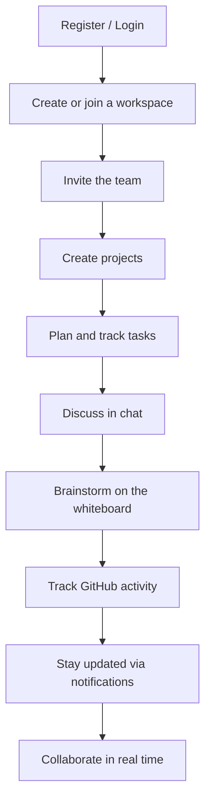

# Product Vision

> Why DevFlow exists, who it is for, and where it is headed.
> Related: [roadmap.md](roadmap.md) · [future-features.md](future-features.md) · [README](../README.md#project-vision)

---

## Purpose

This document captures the product thinking behind DevFlow — the problem it addresses and the experience it aims for. It is the "why" that the technical documents build on.

---

## The Problem

A development team's work is spread across many separate tools: GitHub for code, Jira or Trello for tasks, Slack or Discord for chat, Miro for diagrams, Notion for notes, and Google Meet for calls. Each is capable on its own, but together they impose a cost:

- **Context switching** between tabs and tools all day.
- **Lost context**, because a decision in one tool rarely flows back to another.
- **Repeated setup** for every new project.

---

## The Solution

DevFlow brings these activities into one connected workspace. A task, the conversation around it, the whiteboard that planned it, and the GitHub activity that closes it live in the same place and share the same live state. Changing something in one area can update the others, so the team keeps a single, coherent picture of the work.

---

## Target Users

- Small to mid-sized engineering teams.
- Open-source projects coordinating contributors.
- Student and hackathon teams that need to move fast.
- Individual developers who want one home for their work.

---

## Experience Principles

| Principle | What it means |
|---|---|
| One workspace | The team's work lives in one place, not scattered across tools |
| Real-time by default | Changes are visible to everyone as they happen |
| Connected, not siloed | Tasks, chat, boards, and code reference each other |
| Approachable | Simple enough for a small team to adopt without training |
| Extensible | New capabilities fit the same clean structure |

---

## The Complete Journey (Intended)

Once the platform is built out, a team's flow through DevFlow is meant to be seamless:

> [!NOTE]
> This journey describes the intended product. Today only registration and login exist; the rest is on the [roadmap](roadmap.md).

---

## Long-Term Vision

Build an extensible, production-grade collaboration platform with clean, understandable architecture — a codebase a small team can maintain and grow over time. The measure of success is not a long feature list, but a platform where each new capability fits naturally and the whole stays coherent as it grows.

---

## Developer Notes

- This document is intentionally about product direction, not implementation. The technical "how" lives in [architecture.md](architecture.md) and [system-design.md](system-design.md).
- When a feature is proposed, check it against the experience principles above before the technical design.

---

_Next: [roadmap.md](roadmap.md) — the plan for getting there._
