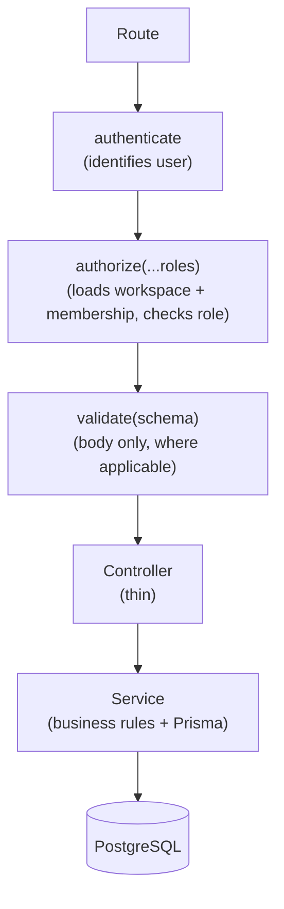
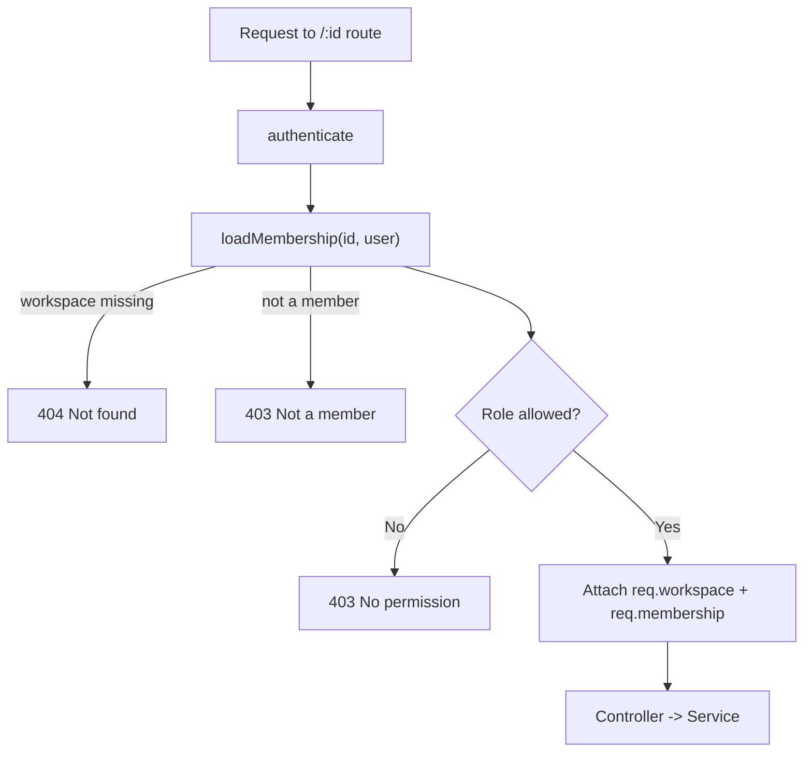

# Workspace Module

> Workspaces, members, and the role-based access control that governs them.
> Related: [backend.md](backend.md) · [authentication.md](authentication.md) · [database.md](database.md) · [api.md](api.md)

---

## Purpose

This document describes the workspace module: what it does, how authorization works, and the decisions behind it. It is the second implemented module after auth, and it is the reference for how workspace-scoped features (projects, tasks, and later chat and boards) should handle membership and roles.

---

## Overview

A **workspace** is the container a team works in. It owns members and, in future, projects, chat, and whiteboards. Each membership carries a **role** that determines what the member can do.

| Role | Can do |
|---|---|
| `OWNER` | Everything, including delete the workspace. Exactly one per workspace (the creator). Cannot leave or be removed. |
| `ADMIN` | Manage the workspace (rename) and members (invite, change roles, remove). |
| `MEMBER` | Read the workspace and its members; leave. |

The data model (`Workspace`, `WorkspaceMember`, `WorkspaceRole`) is documented in [database.md](database.md).

---

## Endpoints

All routes require authentication. Routes with `:id` are workspace-scoped and additionally require the caller to be a member with a sufficient role.

| Method | Path | Min. role |
|---|---|---|
| `POST` | `/api/workspaces` | any user |
| `GET` | `/api/workspaces` | any user |
| `GET` | `/api/workspaces/:id` | member |
| `PATCH` | `/api/workspaces/:id` | `OWNER`/`ADMIN` |
| `DELETE` | `/api/workspaces/:id` | `OWNER` |
| `POST` | `/api/workspaces/:id/invite` | `OWNER`/`ADMIN` |
| `GET` | `/api/workspaces/:id/members` | member |
| `PATCH` | `/api/workspaces/:id/members/:memberId` | `OWNER`/`ADMIN` |
| `DELETE` | `/api/workspaces/:id/members/:memberId` | `OWNER`/`ADMIN` |
| `POST` | `/api/workspaces/:id/leave` | member |

Request and response shapes are in [api.md](api.md#workspaces--apiworkspaces).

---

## Architecture

The module follows the standard layering from [backend.md](backend.md): `routes -> (authenticate -> authorize -> validate) -> controller -> service -> Prisma`.



Files:

| File | Responsibility |
|---|---|
| `workspace.routes.ts` | Endpoint + middleware chain per route |
| `workspace.controller.ts` | Reads request / `req.workspace` / `req.membership`, calls service |
| `workspace.service.ts` | Business rules, Prisma queries, `loadMembership` helper |
| `workspace.validation.ts` | Zod body schemas and inferred types |

---

## Authorization Model

Authorization is **workspace-scoped**: a user's permissions depend on their role *in that workspace*, stored on the `WorkspaceMember` row — not on any global attribute.

The `authorize(...)` middleware ([authorize.middleware.ts](../backend/src/middleware/authorize.middleware.ts)) is the single gate:

```ts
authorize("OWNER")            // owner only
authorize("OWNER", "ADMIN")   // owner or admin
authorize()                   // any member
```

It runs after `authenticate` and:

1. Reads the workspace id from the `:id` route param.
2. Calls the service's `loadMembership(workspaceId, userId)`, which returns the active workspace and the caller's membership — or throws `404` (workspace missing/soft-deleted) or `403` (not a member).
3. If roles were supplied and the caller's role is not among them, throws `403`.
4. Attaches `req.workspace` and `req.membership` for the controller.

> [!IMPORTANT]
> Roles are checked in **one place** — the middleware. Services do not re-check the caller's role; they trust the gate and enforce only business invariants (for example, the owner cannot be removed). Controllers contain no authorization logic. This keeps the rule "all role checks go through middleware" true across the module.



---

## Business Rules

These invariants live in the service, independent of the role gate:

- **Creating a workspace is transactional.** The `Workspace` and the creator's `OWNER` membership are created together, so a workspace can never exist without an owner.
- **Soft delete.** `DELETE` sets `deletedAt`; every read filters `deletedAt: null`. Data is retained.
- **The owner is protected.** The owner's role cannot be changed, the owner cannot be removed, and the owner cannot leave — they must transfer ownership (planned) or delete the workspace.
- **Invite adds existing users only.** `invite` looks up a registered user by email and adds them; there is no email sending and no pending-invitation state. Duplicate members return `409`.
- **No secret leakage.** Member responses use a `select` that exposes only `id`, `name`, `email`, and `avatar` of the linked user.

---

## Design Decisions

| Decision | Choice | Rationale |
|---|---|---|
| Authorization location | `authorize()` middleware | One gate; no duplication in services/controllers |
| Role source | `WorkspaceMember.role` | Permissions are per-workspace, not global |
| Membership loading | Single `loadMembership` helper | One query resolves resource + role; reused by middleware |
| Delete | Soft (`deletedAt`) | Retain data; reversible; safe |
| Invite | Existing users by email | No email dependency yet; simple and secure |
| Owner protection | Enforced in service | A business invariant, not a role check |

---

## Tradeoffs

- **Invite is limited to existing users.** Inviting someone who has not signed up needs a pending-invitation model and email/link delivery — deferred until that flow is built.
- **Single owner, no transfer yet.** The owner cannot leave until ownership transfer exists. This is a deliberate, safe limitation.
- **`authorize` reads the workspace id from `:id`.** Child resources (projects, tasks) will resolve their workspace differently, so they will need their own scoped guard rather than reusing this param directly.

---

## Scalability

- The `@@index([userId])` on `WorkspaceMember` keeps "list my workspaces" efficient as membership grows.
- `loadMembership` uses the `(workspaceId, userId)` unique constraint, so per-request authorization is a single indexed lookup.
- The pattern extends cleanly: project and task modules will nest under a workspace and reuse the same role model.

---

## Testing

The module was verified end to end against a running server (happy paths plus 400/401/403/404/409 authorization and validation cases). A runnable Postman collection is provided:

```bash
newman run backend/postman/devflow-workspace.postman_collection.json
```

See `backend/postman/devflow-workspace.postman_collection.json` for example requests, responses, and error cases.

---

## Best Practices

- Put role checks in the route's `authorize(...)` call, never in the controller or service.
- Read `req.workspace` and `req.membership` in controllers instead of re-querying.
- Keep business invariants (owner protection, duplicates) in the service.
- Filter `deletedAt: null` on every workspace read.
- Return members through the `memberSelect` view; never expose user secrets.

---

## Developer Notes

- `req.workspace` and `req.membership` are typed via `WorkspaceRequest` (from the authorize middleware) and are guaranteed present on `:id` routes.
- `loadMembership` is exported from the service specifically so the middleware can reuse it — this is the one implementation of "resolve workspace + caller role".
- Ownership transfer, and inviting not-yet-registered users, are future work (see [roadmap.md](roadmap.md)).

---

_Next: the Project module builds on this — projects belong to a workspace and reuse this role model._
